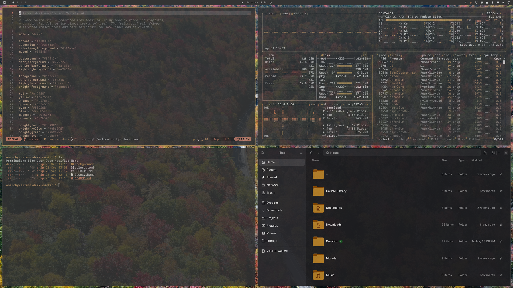

# Autumn Dark Theme for Omarchy

A relaxing dark theme for [Omarchy](https://omarchy.org) built around warm
autumn tones: muted browns and sepia over a soft charcoal background, with a
dusty amber accent.



## Install

```bash
omarchy theme install https://github.com/chipkoziara/omarchy-autumn-dark
```

## Palette

| Role | Hex |
| --- | --- |
| Background | `#343434` |
| Dark background | `#272727` |
| Darker background | `#1a1a1a` |
| Lighter background | `#49433a` |
| Foreground | `#cccccc` |
| Accent | `#a78854` |
| Selection | `#a78854` |
| Selection foreground | `#343434` |
| Muted | `#818181` |

The full ANSI palette lives in [`colors.toml`](colors.toml), which Omarchy uses
to generate the configs for every themed app. Icons are `Yaru-yellow`.
Wallpapers are from Unsplash — see [`CREDITS.md`](CREDITS.md).
